<h1>Matching Game no Logsim</h1>

André Lucas de Souza Lima  
Kayky Moreira Morais  
Ciência da Computação - Universidade Federal do Cariri  
Desenvolvido na disciplina de circuitos digitais  
Instruído pelo docente Ramon Santos Nepomuceno
  

<h2>Do que se trata</h2>

Este projeto é um "Matching Game", jogo envolvendo a memória, criado a partir da aplicação Logisim, que é utilizada para desenvolver circuitos de baixo nível simulados em um meio digital.

Abaixo está a imagem da tela principal:

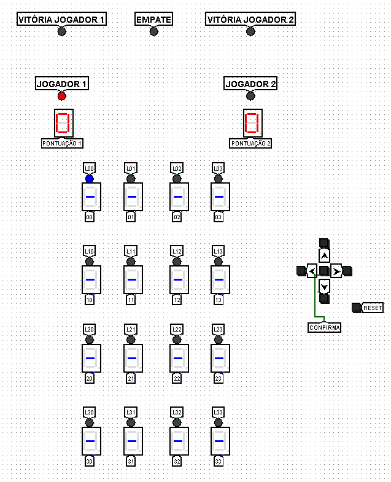

O objetivo principal foi oferecer uma experiência divertida em um jogo funcional e nos desafiar com o uso majoritário de estruturas de memória, como flip flops, registradores, contadores e outras ferramentas que foram essenciais para a implementação final.

Também foram necessárias diversas revisões ao longo do trabalho feito para que o resultado fosse sólido e não houvessem inconsistências ou bugs, como os que serão mostrados e explicados depois.

<h2>Como instalar o Logisim</h2>

A forma mais rápida e segura de instalar o Logisim é pelo site SourceForge, conhecido por disponibilizar downloads em uma plataforma sólida.  
Passos para instalar:  
Ao acessar este <a href="https://sourceforge.net/projects/circuit/">link</a>, você deve ser redirecionado para a página do Logisim no SourceForge, que será parecida com a seguinte imagem:

Aqui, basta apenas apertar o botão principal escrito "Download", que transferirá um executável para seu navegador e solicitará um local de armazenamento no computador.  
Após isso, o Logisim já estará instalado e pronto para ser executado por meio desse arquivo.

<h2>Como jogar (regras)</h2>

O Matching Game (ou jogo da memória) é jogado por dois jogadores que devem usar sua capacidade de memorizar as cartas para vencer.

Basicamente, o jogo se passa em turnos, em que cada jogador escolhe duas cartas diferentes para que seus números ocultos sejam revelados. Caso os números sejam iguais, a pontuação do jogador que conseguiu adivinhar corretamente é acrescida em um e as cartas escolhidas têm seus números revelados e não podem ser selecionadas até o final do jogo. Caso contrário, a pontuação se mantém a mesma e os números das cartas voltam a serem escondidos.

De qualquer forma, após a verificação de acerto, a vez é passada ao outro jogador, e isso se repete até que todas as cartas tenham sido reveladas e um dos jogadores vença ou haja um empate.

<h2>Funcionamento</h2>

<h3>Máquina de estado</h3>

O prolongamento do jogo foi dividido em quatro estados para que os processos acontecessem de forma organizada e certa, tais estados são passados conforme as ações dos jogadores e possuem certas funcionalidades a ocorrerem em seus momentos, são eles:

Estado 0 - esse é o de repouso, em que o circuito em que o circuito espera pela escolha da primeira carta do jogador.

Estado 1 - após a seleção, o jogador aperta no botão "CONFIRMA" sobre o display que quer e então, o número da carta é exibido e armazenado como o valor da primeira seleção. Depois, há a espera pela segunda escolha.

Estado 2 - da mesma forma que no estado 1, o botão "CONFIRMA" é pressionado sobre uma carta diferente da primeira, seu valor é revelado e guardado como o primeiro número. Em seguida, ocorre um aguardo para a passagem ao próximo estado.

Estado 3 - repetindo o pressionamento do botão "CONFIRMA" mais uma vez sobre qualquer display, o circuito compara ambos os números escolhidos e caso sejam iguais, há a pontuação para o jogador do turno e os displays escolhidos continuam ligados até o fim do jogo. Caso sejam diferentes, não é contado ponto ao jogador e os valores são escondidos novamente. Ao final desse estado, ele é automaticamente passado para o inicial, formando um looping.

Para que o circuito identifique o que fazer em cada um dos momentos do jogo, uma máquina de estados foi implementada, que é a representada abaixo:

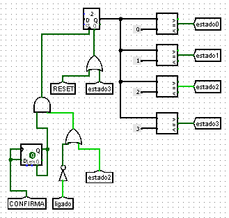

Assim que o botão confirma é acionado (com delay), seu pulso se junta em um AND vindo de um OR com um túnel "ligado" negado e um "estado 2" para acresentar o valor de um contador responsável por representar o estado atual. Essa estrutura garante que a escolha da segunda carta só ocorra se a escolha não seja a mesma da primeira pelo túnel "ligado" (que retorna 1 caso o led atual esteja ligado) barrado ao mesmo tempo que garante que o estado seja alterado automaticamente na situação em que o atual for o estado 2, para que assim o jogador não precise apertar o botão "CONFIRMA" desnecessariamente.

À direita da imagem, o resultado do contador é obtido e comparado quatro vezes para que possa passar o valor 1 apenas para o túnel referente a seu estado real.

<h3>Leds</h3>

Os leds de seleção são uma forma efetiva para que o jogador se localize e navegue pelos displays para que assim faça sua escolha de jogada.

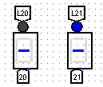

Na imagem acima, o led representa o círculo acima do display hexadecimal. Ele está desligado à esquerda da imagem e ligado na direita.

Eis o controle que permite a navegação e define os leds acesos e desligados:

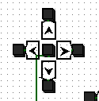

Intuitivamente, os botões representam as direções de navegação entre os leds no grid do jogo, podendo ser para cima, baixo, esquerda e direita.

A estruturação usada para implementar essa mudança de leds é:

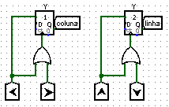

A lógica é que a posição do led seja representada como uma dupla de linha e coluna armazenadas em contadores, com valores maiores para a linha e coluna apontarem para leds mais à direita e abaixo, já que o led (0, 0) é o situado no canto superior esquerdo do grid.

No caso das setas à direita ou abaixo serem apertadas, os contadores de coluna ou linha, respectivamente, recebem um clock e são aumentados em uma unidade. Em contraposição, o acionamento das setas à esquerda ou acima aciona esse mesmo clock ao mesmo tempo que a entrada "load", a qual faz com que o ele diminua o contador em uma unidade.

<h3>Displays</h3>

Os displays hexadecimais são a representação visual do valor armazenado em cada uma das "cartas" do jogo. Eles permanecem desligados (traço no meio) até que sejam selecionados para terem seus valores revelados.

Essa escolha ocorre pela escolha do led acima do display, o que vai fazer com o que ele acenda, seguido pelo acionamento do botão "CONFIRMA", dessa maneira o display correspondente é aceso. 
Eis o mecanismo responsável por acender o display:

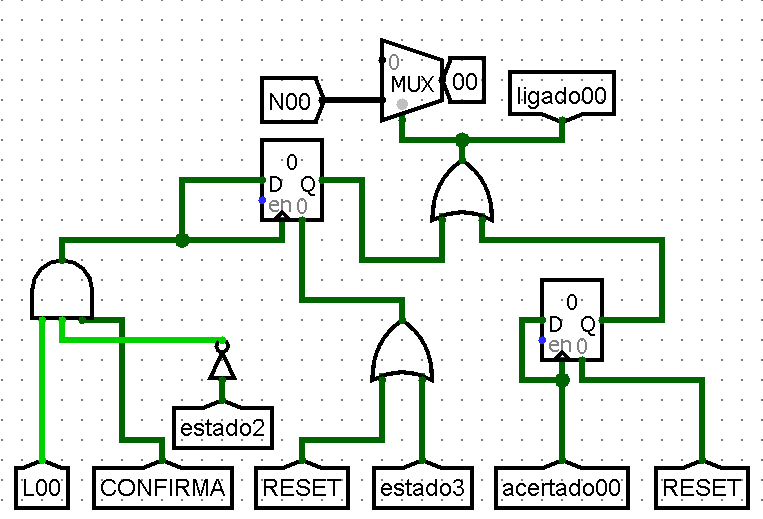

Quando o botão "CONFIRMA" é pressionado, ele gera um pulso que aciona o clock do registrador, passando por uma porta AND entre o pulso "CONFIRMA", o led (para acender o correspondente) e um estado 2 negado(será explicado melhor adiante). Esse registrador tem apenas um bit de dados e guarda a informação se o display foi escolhido.
Uma vez escolhido, ele passa a informação para um multiplexador e para um túnel "ligadoxy", o qual será útil para verificar se o display já foi aceso ou não. O multiplexador libera o valor do número correspondente no valor de entrada alto para o túnel "xy" (no caso da imagem, "00"), que se conecta ao display e o acende.
O mecanismo que guarda os números escolhidos pelos jogadores é mostrado a seguir:
  

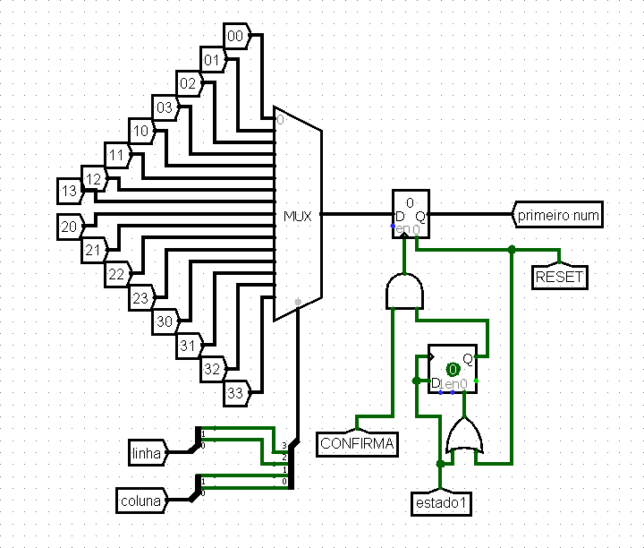

Os números são as entradas do MUX, e o seletor é composto pela combinação dos bits da linha e coluna. Para guardar o primeiro número (no estado 0), assim que há o pulso do "CONFIRMA" também há a troca de estado para 1,assim a partir da porta OR dos dois túneis, o clock do registrador é acionado e guarda o primeiro número escolhido. Para guardar o segundo é o mesmo mecanismo, exceto pelos túneis "estado 2" e "segundo num".

<h3>Verificação</h3>

Os túneis "primeiro num" e "segundo num" são comparados, e quando a máquina passa pelo estado 3, surge um pulso no túnel "check":

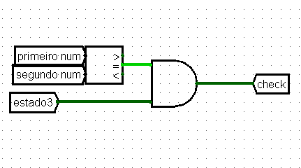

Esse túnel "check" é necessário para permitir que os displays permaneçam acesos. A lógica para permanecer o display aceso é aseguinte: A partir de um AND entre os túneis "ligadoxy", vistos anteriormente, e o "check". Se o número foi acertado, o túnel "acertadoxy" é acionado, e deixa o segundo registrador dos displays em 1, o qual só volta a 0 a partir do reset. Dessa forma, com o registrador em 1 e a porta OR, ele força o display ficar aceso após o acertado. 

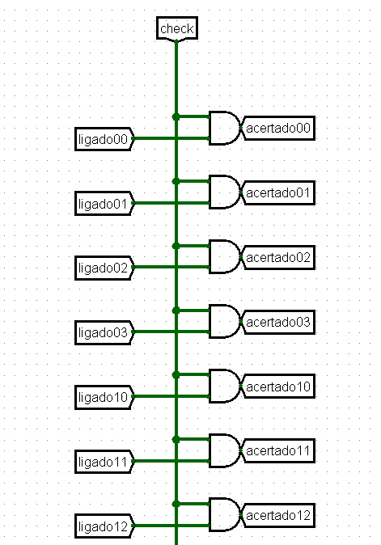

<h3>Pontuação (e próximo turno)</h3>

Quando os pares estão corretos, o "check" também é direcionado para o mecanismo de pontuação. A pontuação é registrada em um contador, incremetado a cada acerto e de acordo com o jogador que pontuou. Isso é garantido pelo OR entre o "check" e o "jogador"(negado se for o jogador 1). As pontuações são passadas pelos tunéis "PONTUAÇÃO" para que apareçam na tela principal.

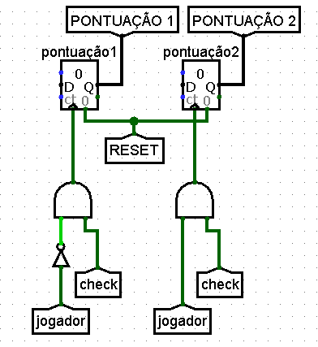

A troca de jogador ocorre sempre no estado 3 (e em seguida da pontuação, se houver). Os jogadores são representados por um contador de 1 bit, que se reinicia a cada troca. A troca acontece por um AND entre a saída do registrador que armazena a informação que o circuito passou pelo estado 3 e um "check" negado, pois não pode haver a troca de jogador enquanto pontua para evitar erros. O túnel "jogador" é dividido para os túneis "JOGADOR 1" e "JOGADOR 2" a fim do turno de cada jogador ser exibido na tela.

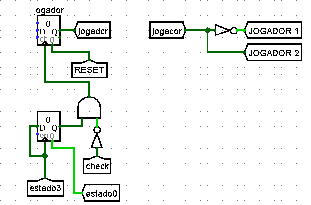

<h3>Restrição de estado</h3>

Com o intuito de evitar a escolha de um display já aceso (seja porque foi escolhido primeiro ou já acertado), um mecanismo de restrição de estado foi criado. A princípio, ele impede que haja a troca de estado se o jogador apertar num display já aceso. Ele é feito a partir de um AND entre o "CONFIRMA" e um OR entre o túnel "ligado" barrado e "estado 2".

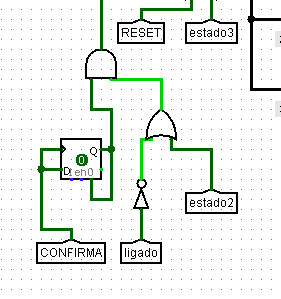

O túnel ligado é composto por um OR de 16 entradas, cada entrada é um AND entre o "ligadoxy" e o "ledxy" correspondente. Caso o player decida escolher um display já aceso ele precisará mover o led até o display indicado, ao fazer isso, o AND aciona o túnel "ligado", que informa se o display escolhido já está ligado. Dessa maneira, é preciso que o display escolhido pelo jogador *não* esteja aceso, por isso o uso da porta NOT.

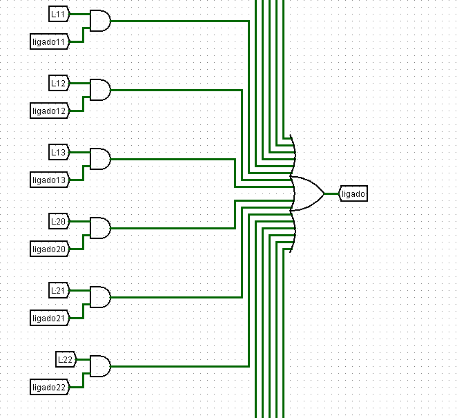

O motivo por trás do OR com "estado 2" é bastante simples: no estado 2 não há o armazenamento de dados, dessa forma, mesmo que um led esteja aceso em cima de um display ligado, não há problema apertar o confirma pois nenhum valor será armazenado que altere o resultado da rodada (se pontuou ou não) e a troca de jogador. Sem esse OR, seria necessário que o jogador mudasse para um display desligado apenas para passar a vez, o que não é eficiente.

<h3>Correção de eventuais bugs</h3>

Durante a construção do circuito, alguns bugs surgiram principalmente por motivos de atraso de clock. A fim de resolvê-los, algumas modificações foram feitas em partes específicas do circuito.
O primeiro deles é relacionado ao atraso do túnel "CONFIRMA" na máquina de estado. Ele foi conectado a um flip flop D, a saída foi conectada ao AND de confirmação e ao clear, permitindo que apenas um único pulso de clock seja ativado. Anteriormente a essa modificação, o pulso do "CONFIRMA" gerava a mudança de estado e entrava em conflito com o túnel "ligado", o que ignorava o estado 0 e passava do estado 3 direto para o 1. 

Além disso, flip flops D também foram adicionados ao pulso do "estado 1" e "estado 2" nos registradores que guardam os números escolhidos para garantir seu funciomnamento.

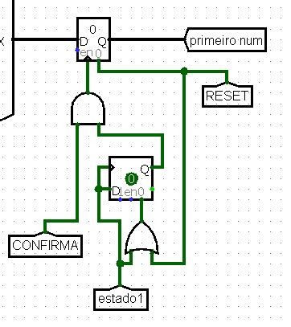

No contador pesponsável pelo turno dos jogadores, foi preciso adicionar um registrador para o estado 3 e um "check" negado pois no estado 3 ocorrem a pontuação e a troca de jogador, o que ocasionava um pulso suficiente para pontuar os dois jogadores ao mesmo tempo. Portanto, a modificação feita guarda o estado 3 e, quando a já pontuação ter sido feita (ou seja, *não* está checando), logo após passa o turno.

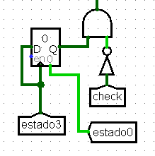

Por fim, a última alteração realizada foi inserir uma porta AND de três entradas para o registrador dos displays, pois sem isso, caso um player acertasse um par, e mudasse para outro display desligado antes de passar a vez, este era aceso e impedia o andamento do jogo.

<h3>Aleatoriedade</h3>

O circuito possui um sistema simples de aleatoriedade. Ele funciona a partir de um gerador de número aleatório de 4 bits que, a depender do número gerado, seleciona uma sequência para ser exibida em cada linha do jogo.

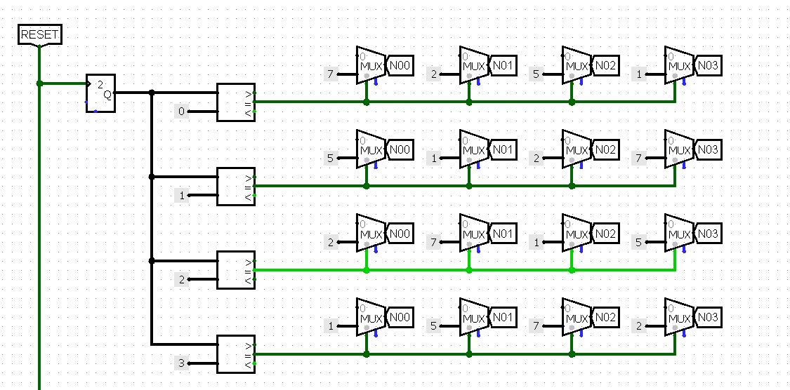

Seguindo a imagem acima como exemplo, se o gerador marcar 0, o número 7 é exibido no display do túnel "N00", já se marcar 2, o número 2 é exibido. Assim, como são 4 linhas, há 4 geradores e cada gerador possui 4 sequências diferentes, o que fornece um total de 256 possibilidades. 
